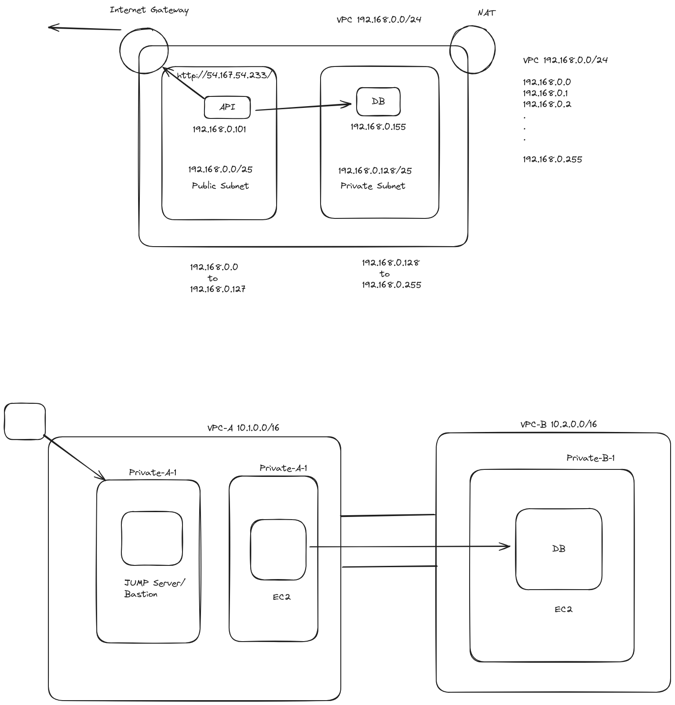

# Exam - Module Four
### Part 1:  Setup two Amazon EC2 instance, each in a sperate VPC
### Part 2: Install and configure and Nginx server on on of the instance, which should be located within a private subnet of its respective VPC. 
### Part 3: Configure the second EC2 instance, situated in a private subnet of the other VPC, to establish communication with the Nginx server

### Projects architecture diagram

### Video Link 
- [Create a VPC and launch a EC2 instance](https://youtu.be/2V0cjdHbEIo?si=KyAJZQbqYKyXY5Ia)
- [Peering with two VPC](https://youtu.be/b3MGCr76eFM?si=mA0187lyLQcblYN-)
