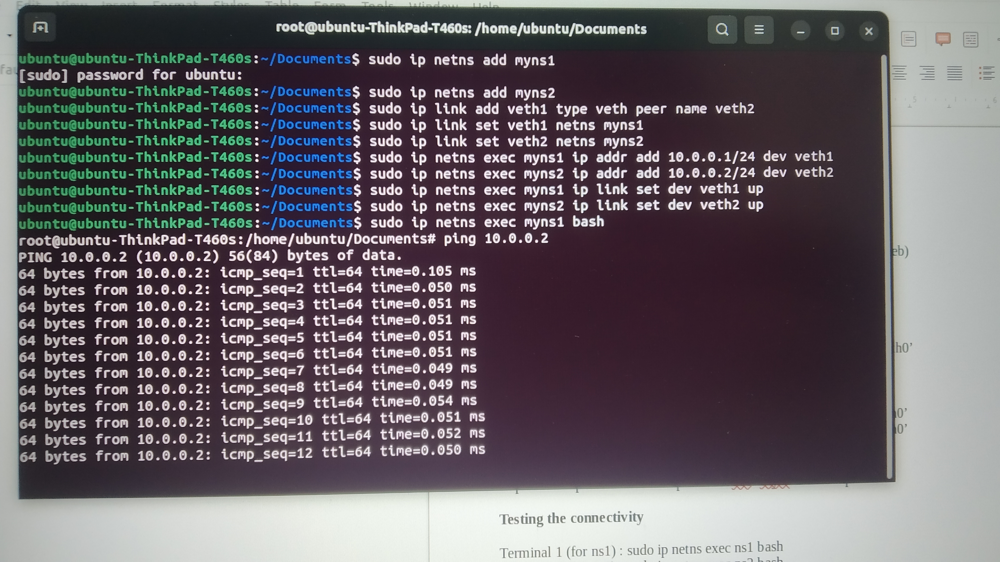

# Exam - Module 1

### Projects - Create two Namespaces and connect them using veth (vm)

#### 1. Create the namespaces
`
step 1: sudo ip netns add ns1
step 2: sudo ip netns add ns2
`

#### 2 Create a veth cable with two interface like myns-1-eth0 and myns-2-eth0
`
step 3: sudo ip link add ‘myns-1-eth0’ type veth peer name ‘myns-2-eth0’
`

#### 3. Next, Connect myns-1-eth0 interface to ns1 and myns-2-eth0 to nas2 namespaces:
`
step 4: sudo ip link set ‘myns-1-eth0’ netns ns1
step 5: sudo ip link set ‘myns-2-eth0’ netns ns2
`

#### 4. Configure IP addresses for the veth interface :

`
step 6: sudo ip netns exec ns1 ip addr add 10.0.0.1/24 dev ‘myns-1-eth0’
step 7: sudo ip netns exec ns2 ip addr add 10.0.0.2/24 dev ‘myns-2-eth0’
`
	
#### 5. Enable the veth interface
`
step 8: sudo ip netns exec ns1 ip link set dev ‘myns-1-eth0’ up
step 9: sudo ip netns exec ns2 ip link set dev ‘myns-2-eth0’ up
`

#### Route up
- sudo ip netns exec ns1 ip route add default via 10.0.0.1 dev eth0
- sudo ip netns exec ns2 ip route add default via 10.0.0.2 dev eth0

#### Test connectivity
- sudo ip netns exec ns1 ping -c 10.0.0.1
- sudo ip netns exec ns2 ping -c 10.0.0.2

#### 6. Testing the connectivity

`
Terminal 1 (for ns1) : sudo ip netns exec ns1 bash
Terminal 2 (for ns2) : sudo ip netns exec ns2 bash
`

In terminal 1 (ns1), you can now ping the IP address myns-2-eth0 in ns2

`ping 10.0.0.2`

### Output

### Reference

- [veth](https://man7.org/linux/man-pages/man4/veth.4.html)

