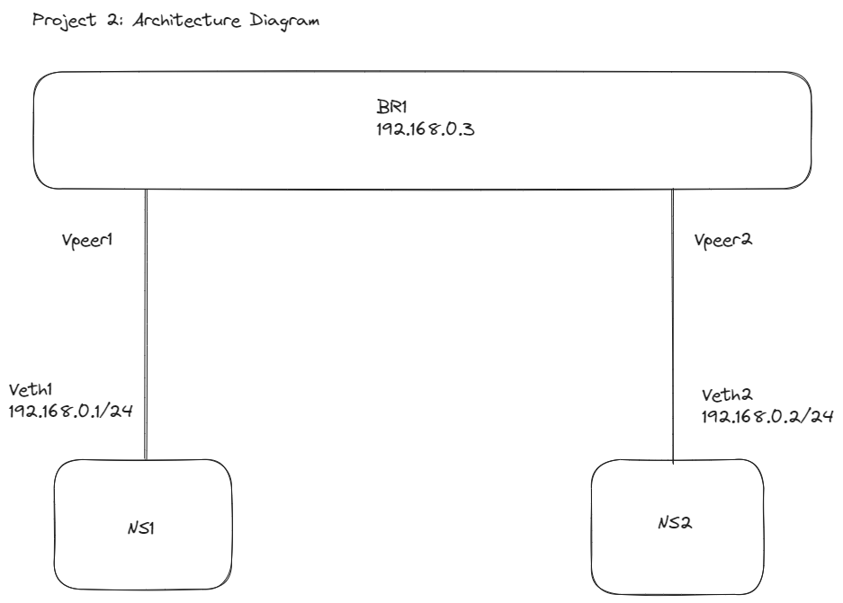
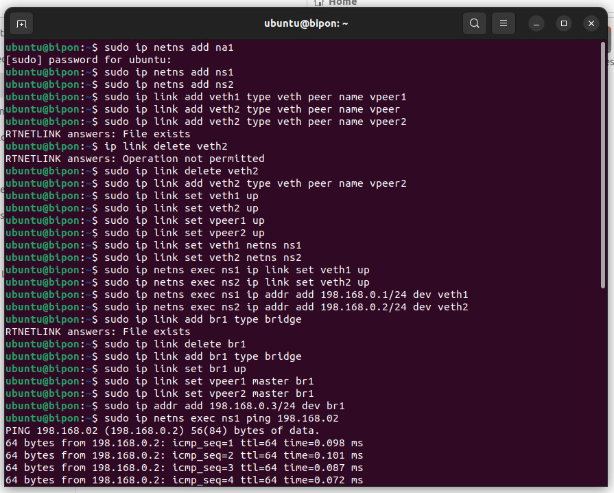

# Exam - Module 2
### Part 1:  Make two network namespaces using 'red' and 'green' names, connect them with a bridge, and check connectivity.
### Part 2: You have to successfully ping Google's public IP from those network namespaces.

### Projects two architecture diagram

#### 1. Create the namespaces
`
step 1: sudo ip netns add ns1
step 2: sudo ip netns add ns2
`

#### 2 Create a veth cable with two interface like veth1 and veth2
`
step 3: sudo ip link add veth1 type veth peer name veth2
`

#### 3. Next, Connect veth1 interface to ns1 and veth2 to nas2 namespaces:
`
step 4: sudo ip link set veth1 netns ns1
step 5: sudo ip link set veth12 netns ns2
`

#### 4. Configure IP addresses for the veth interface :

`
step 6: sudo ip netns exec ns1 ip addr add 192.168.0.1/24 dev veth1
step 7: sudo ip netns exec ns2 ip addr add 192.168.0.2/24 dev veth2
`
	
#### 5. Enable the veth interface
`
step 8: sudo ip netns exec ns1 ip link set dev veth1 up
step 9: sudo ip netns exec ns2 ip link set dev veth2 up
`

#### 6. Create a Bridge Interface

`
step 10: sudo ip link add name br0 type bridge
`

#### 7. Connect the Bridge to the Host Network

`
step 11: sudo ip link set dev br0 up
`

#### 8. Connect the veth Interfaces to the Bridge

`
step 12: sudo ip link set veth1 master br0
step 13: sudo ip link set veth2 master br0
`

#### 9. Testing the connectivity

`
step 14: sudo ip netns exec ns1 ping 192.168.0.2
`

`
Terminal 1 (for ns1) : sudo ip netns exec ns1 bash
Terminal 2 (for ns2) : sudo ip netns exec ns2 bash
`

In terminal 1 (ns1), you can now ping the IP address myns-2-eth0 in ns2

`ping 10.0.0.2`

### Output

### Command 
- sudo ip netns list (showing all Namespaces)
- ip link show (check for existing interface)
- ip netns delete ns1
- ip netns delete ns2
- ip link delete veth1
- ip link delete br0

