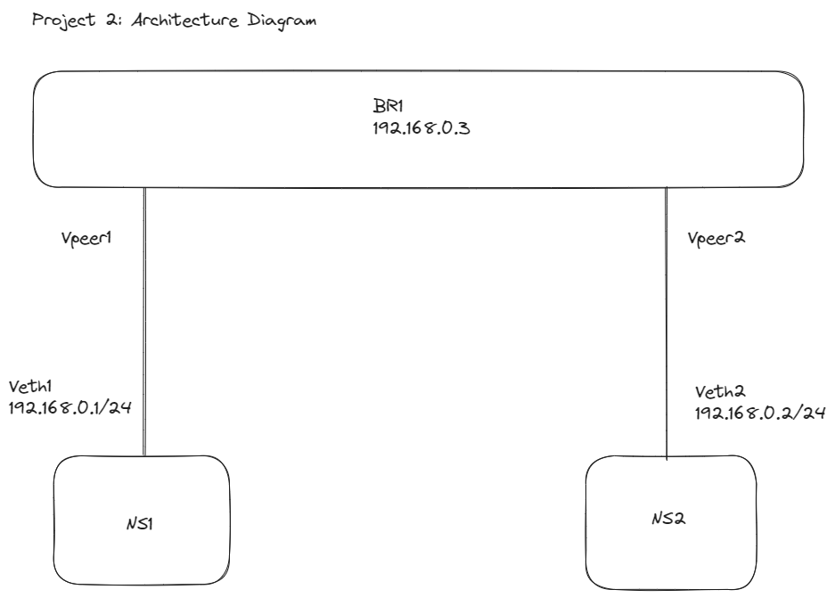

# Exam - Module 2 (Network for DevOps)
### Part 1:  Make two network namespaces using 'red' and 'green' names, connect them with a bridge, and check connectivity. [Video 1](https://youtu.be/Oe-wweXi14Q?si=7JNWaViWMBcEoBgp), [Video 2](https://youtu.be/Whrwyw1t298?si=EV5wlmm-rVfM6IU1)
### Part 2: You have to successfully ping Google's public IP from those network namespaces.

### Projects two architecture diagram

#### 1. Create the namespaces
`
step 1: sudo ip netns add ns1
step 2: sudo ip netns add ns2
`

#### 2 Create a veth cable with two interface like veth1 and veth2
`
step 3: sudo ip link add veth1 type veth peer name veth2
`

#### 3. Next, Connect veth1 interface to ns1 and veth2 to nas2 namespaces:
`
step 4: sudo ip link set veth1 netns ns1
step 5: sudo ip link set veth12 netns ns2
`

#### 4. Configure IP addresses for the veth interface :

`
step 6: sudo ip netns exec ns1 ip addr add 192.168.0.1/24 dev veth1
step 7: sudo ip netns exec ns2 ip addr add 192.168.0.2/24 dev veth2
`
	
#### 5. Enable the veth interface
`
step 8: sudo ip netns exec ns1 ip link set dev veth1 up
step 9: sudo ip netns exec ns2 ip link set dev veth2 up
`

#### 6. Create a Bridge Interface

`
step 10: sudo ip link add name br0 type bridge
`

#### 7. Connect the Bridge to the Host Network

`
step 11: sudo ip link set dev br0 up
`

#### 8. Connect the veth Interfaces to the Bridge

`
step 12: sudo ip link set veth1 master br0
step 13: sudo ip link set veth2 master br0
`

#### 9. Testing the connectivity

`
step 14: sudo ip netns exec ns1 ping 192.168.0.2
`

`
Terminal 1 (for ns1) : sudo ip netns exec ns1 bash
Terminal 2 (for ns2) : sudo ip netns exec ns2 bash
`

In terminal 1 (ns1), you can now ping the IP address myns-2-eth0 in ns2

`ping 10.0.0.2`

### Output

### Command  
- sudo ip netns list (showing all Namespaces)
- ip link show (check for existing interface)
- ip netns delete ns1
- ip netns delete ns2
- ip link delete veth1
- ip link delete br0
- ifconfig
- ip route show (show route table in current server)
- ip link list 
- ip netns list
- ip netns
- ip addr (showing device info)
- sudo iptables -L (showing iptables rule interface)
- `sudo apt update` `sudo apt install net-tools` `sudo apt install iproute2 -y` `sudo apt install tcpdump` `sudo apt install iputils-ping`
- `sudo apt install net-tools iproute2 tcpdump iptables iputils-ping -y`
- tcpdump `sudo tcpdump -i veth1`
- route added `ip route add default via 192.168.0.1`
- `sudo tcpdump -i wlp4s0 icmp`
- `sudo iptables -t nat -L -n -v`
- SNAT Apply `sudo iptables -t nat -A POSTROUTING -s 198.168.0.0/16 -j MASQUERADE`

### Reference
- [Using veth network interface to connect two network namespaces](https://www.youtube.com/watch?v=6zgHhEpnTGI)
- [Connecting two network namespaces](https://medium.com/@technbd/creating-network-namespaces-in-linux-system-and-connecting-two-network-namespaces-using-virtual-6031d295f69b)

