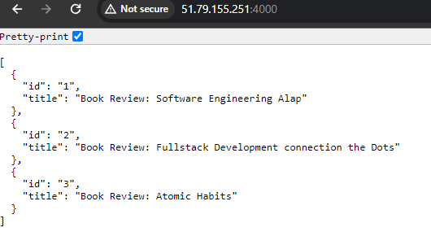

# Module 3 - Docker assignment
- Assignment video : https://youtu.be/BzMZsOwtIBs?si=qdntZUvxNNVSG4oq
- Containerize a react (frontend) application
- Containerize a python api (backend) application
- Show connectivity between the two applications

**Note**: The focus here is containerization using docker. You are free implement the ui and api as you wish. 
You must fetch some data from your api and show it to your frontend application. Bonus if you put a reverse proxy in between thr frontend and backend.


### Step by step guide for project

- To create a project called my-blog, run this command: `npx create-react-app my-blog`
- Step 1: create a folder like node-api in desktop or any location in your computer
- Step 2: open VS Editor > Terminal (keyboard command : Ctrl + ~) then run `yarn init`. Create a `package.json` file
- Step 3: create a `index.js` file into `app` folder

### To deploy a React project using Docker, you can follow these general steps:

1. **Create a Dockerfile**: This file contains instructions for building a Docker image for your React project.
2. **Build the Docker Image**: Use the Dockerfile to build the Docker image that contains your React project.
3. **Run the Docker Container**: Once the image is built, run a Docker container based on that image.

Here's a basic example to guide you through the process:

1. Create a Dockerfile

### Frontend Docker File

<details><summary>show</summary>
<p>

FROM node:16-alpine

WORKDIR /app

COPY package.json .

RUN npm install

COPY . .

# Build the React app
RUN npm run build

# Expose the port your app runs on
EXPOSE 3000

CMD ["npm", "start"]

</p>
</details>

2. Build the Docker Image
Open a terminal, navigate to the directory containing your Dockerfile and run:
`docker build -t my-react-app2 .`

3. Run the Docker Container
Once the image is built, you can run a container based on that image:

`docker run -d -p 3000:3000 my-react-app`

### API Docker File

<details><summary>show</summary>
<p>

FROM node:17-alpine

RUN npm install -g nodemon

WORKDIR /app

COPY package.json .

RUN npm install

COPY . .

EXPOSE 4000
# required for docker desktop port mapping

CMD ["npm", "run", "dev"]

</p>
</details>

### Project deployed to your remote ubuntu server.
To deploy your React project to a remote Ubuntu server using Docker, you'll need to follow these steps:

**On your local machine:**
1. Build Docker Image: Build your Docker image as explained in the previous instructions.

2. Push Docker Image to a Registry (Optional): If you're using a Docker registry (like Docker Hub), you can push your image to the registry. 
This step is optional but can be useful for sharing the image or deploying it to multiple servers without rebuilding.

```bash
docker tag my-react-app2 bipon68/my-react-app2
docker push bipon68/my-react-app2
```
**Note** Replace `username` with your Docker Hub username or the appropriate registry URL.

**On your remote Ubuntu server:**
1. Install Docker and Docker Compose
2. Pull Docker Image

```
docker pull bipon68/my-react-app2
```
**Note** Replace username/my-react-app with the image name you've built or pushed.
3. Run Docker Container: Run the Docker container on your remote server:
```
docker run -d -p 80:3000 username/my-react-app
```
4. **Access Your Application**: Now your React app should be accessible on your remote server's IP address or domain name. If you mapped it to port 80, you should be able to access it directly via the server's IP address or domain.

### Access application

- Frontend Access `http://51.79.155.251/`
- Api Access `http://51.79.155.251:4000/`

### Output



### What I learn 
- [x] Containerize application
- [x] Connectivity between the two applications
- [x] How to deploy real server 

### Faching Issues

```
Uncaught (in promise) SyntaxError: Unexpected token '<', "<!DOCTYPE "... is not valid JSON
```

### Reference
- [Docker Hub](https://hub.docker.com/)
